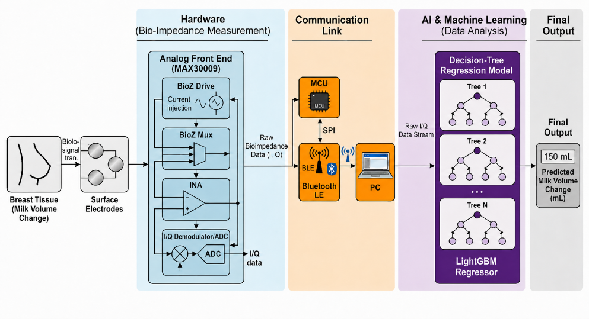
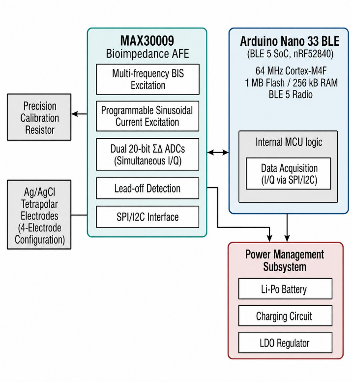
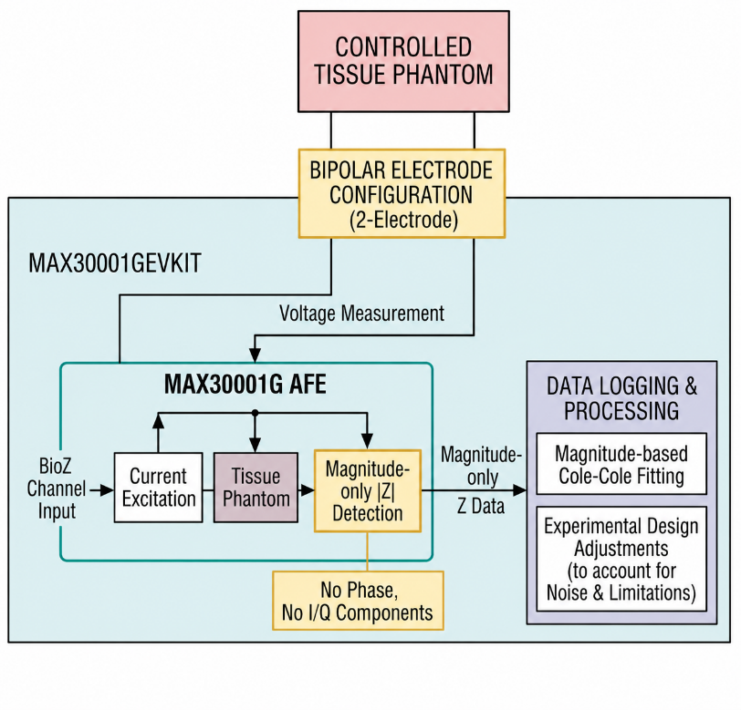
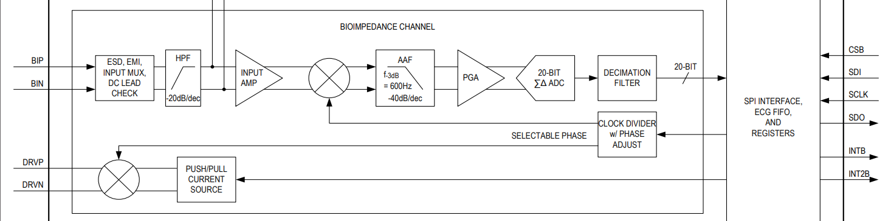
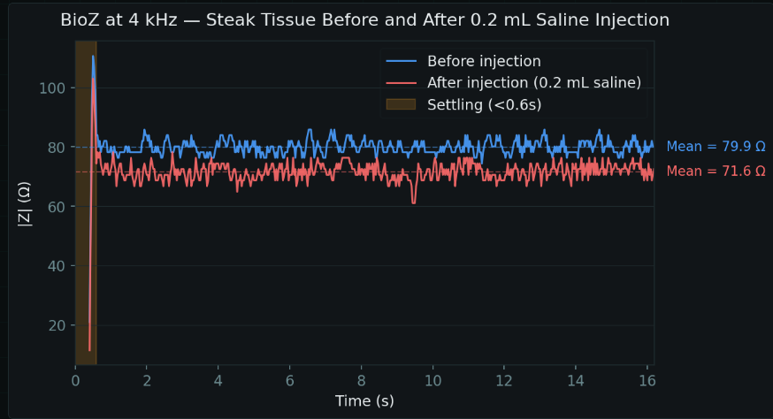
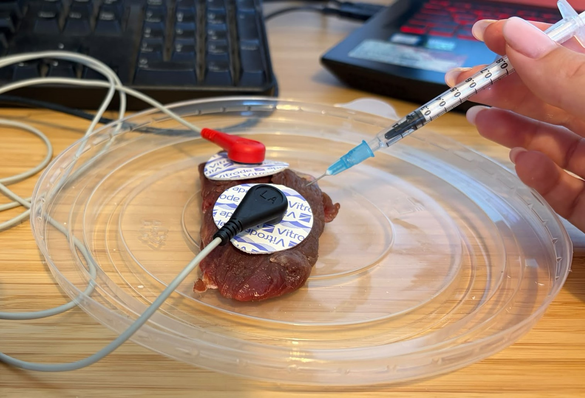
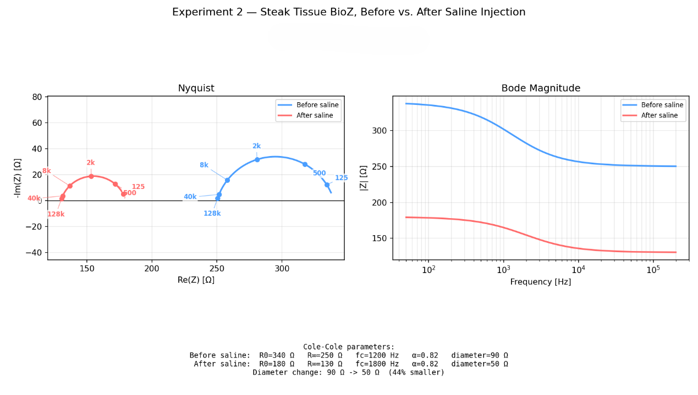
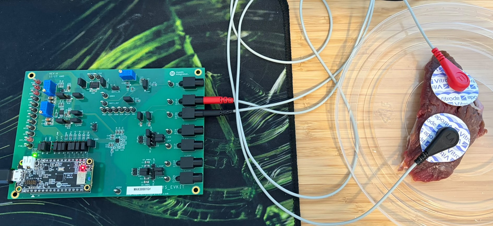

# Wearable Sensor for Real-Time Bioimpedance Monitoring

A wearable, non-invasive sensing system for estimating breast milk volume changes during breastfeeding, combining multi-frequency bioimpedance spectroscopy (BIS) hardware with a physics-informed machine learning pipeline.

**Project No.:** 25-1-1-3349  
**Students:** Tal Goren, Noy Kiselnik  
**Supervisor:** Shachar Ashkenasy, GDL Lab
**Carried out at:** Iby and Aladar Fleischman Faculty of Engineering, Tel Aviv University


*Figure 1 — End-to-end pipeline: breast tissue → surface electrodes → MAX30009 BioZ analog front-end → BLE link → LightGBM regression → predicted milk volume change.*

## Table of Contents

- [Overview](#overview)
- [How It Works](#how-it-works)
- [Repository Structure](#repository-structure)
- [Hardware](#hardware)
- [Software / ML Pipeline](#software--ml-pipeline)
- [Phantom Experiments](#phantom-experiments)
- [Results](#results)
- [Getting Started](#getting-started)
- [Limitations & Future Work](#limitations--future-work)
- [References](#references)

## Overview

Measuring how much milk an infant consumes during breastfeeding is a real clinical challenge — the standard method (weighing the infant before/after feeding) is indirect, cumbersome, and unsuitable for continuous monitoring.

This project proposes a wearable alternative based on **Bioimpedance Spectroscopy (BIS)**: breast milk is an extracellular conductive fluid, so as it is removed during feeding, tissue conductivity drops and the measured electrical impedance rises — especially at low frequencies. By measuring impedance across a range of frequencies (rather than one fixed frequency, as in prior work) and learning the nonlinear relationship between the impedance spectrum and volume change, the system estimates milk volume consumed between two time points in a feeding session.

The project spans three parts:
1. **Hardware** — a BioZ analog front-end (AFE) + BLE microcontroller for acquiring multi-frequency impedance data.
2. **Physical modeling** — fitting the **Cole-Cole bioimpedance model** to raw impedance spectra to obtain physically meaningful features.
3. **Machine learning** — regression models (LightGBM, MLP, 1D CNN) trained to predict milk volume change (mL) from those features.

Because ethical/regulatory constraints prevent live breastfeeding experiments, the ML pipeline was trained and validated on a **synthetic dataset** generated from real breastfeeding measurements, while the hardware/measurement chain was validated on **ex-vivo tissue phantoms** (potato and beef steak, salted to mimic conductivity changes).

## How It Works

### Bioimpedance & the Cole-Cole model

Biological tissue behaves electrically as a mix of resistive (conductive fluid) and capacitive (cell membrane) elements. At low frequencies, current is largely confined to extracellular fluid; at high frequencies it can pass through the intracellular space too. Since breast milk is an extracellular fluid, its removal mainly affects the **low-frequency resistance**.

The Cole-Cole model compactly describes this frequency-dependent response:

$$Z(\omega) = R_\infty + \frac{R_0 - R_\infty}{1 + (j\omega\tau)^\alpha}, \qquad \tau = \frac{1}{2\pi f_c}$$

| Parameter | Meaning |
|---|---|
| `R0` | DC / low-frequency resistance — reflects extracellular fluid volume (expected to increase as milk is removed) |
| `R∞` | High-frequency resistance — total conductive pathways |
| `fc` | Characteristic frequency — where capacitive behavior is most significant |
| `α` | Dispersion exponent — reflects tissue heterogeneity |

Fitting is done per electrode pair, per time point, via nonlinear least squares (see [`Code/cole_cole.py`](Code/cole_cole.py)).

### Regression formulation

Each sample corresponds to one pair of measurement time points `(t_i, t_j)` within a feeding session. The model learns `y = f(x)`, where `x` is a feature vector derived from the impedance spectra of both time points (across 4 electrode pairs), and `y` is the milk volume change in mL.

## Repository Structure

```
.
├── Code/                        # ML pipeline (Python)
│   ├── data_loader.py           # Loads raw simulated impedance CSVs, merges 4 electrode pairs
│   ├── features.py              # Feature extraction: "cole_cole" (physics features) vs "raw" (full spectra)
│   ├── cole_cole.py             # Cole-Cole model + nonlinear least-squares fitting
│   ├── train.py                 # LightGBM training/evaluation entry point
│   ├── mlp_train.py             # MLP (PyTorch) trained on raw spectra
│   └── cnn_train.py             # 1D CNN (PyTorch) trained on raw spectra as multi-channel signals
├── Experiments/                 # Ex-vivo phantom validation (MAX30001GEVKIT)
│   ├── Experiment1/data/        # Potato phantom: dry vs. saline-soaked, 125 Hz–4 kHz sweep
│   ├── Experiment2/             # Steak phantom: multi-frequency (125 Hz–128 kHz), with/without saline
│   │   └── steak_bioz_report.html
│   └── Sensitivity_Exp/         # Steak phantom: 0.2 mL saline injection sensitivity test @ 4 kHz
│       └── sensitivity_report.html
├── docs/images/                 # Figures extracted from the project report (see below)
├── Project Report.docx          # Full report (English)
└── README.md
```

## Hardware

### AFE selection

Two Analog Devices bioimpedance AFEs were evaluated for the wearable design:

| | AD5940/AD5941 | MAX30009 |
|---|---|---|
| Frequency range | Up to 200 kHz | 16 Hz – 500 kHz (single BioZ channel) |
| Impedance output | Real/imaginary via on-chip DFT accelerator | Simultaneous I/Q via dual 20-bit ΣΔ ADCs |
| Electrode config | 2 / 3 / 4-wire | Bipolar & tetrapolar |
| ADC resolution | 16-bit | 20-bit |
| Package size | 3.6×4.2 mm (AD5940) / 7×7 mm (AD5941) | 2.03×2.03 mm |
| Extra features | Programmable sequencer, ECG pairing | Built-in lead-on/lead-off detection |

**Recommended final architecture:** MAX30009 (smaller, wider bandwidth, lead-off detection) + Arduino Nano 33 BLE, tetrapolar Ag/AgCl electrodes, Li-Po power management.


*Figure 3 (left) — Recommended MAX30009 + Arduino Nano 33 BLE wearable architecture.*

### Hardware actually used for validation

Due to procurement constraints, the **MAX30001GEVKIT** was used instead for a controlled tissue-phantom validation. This introduces two limitations versus the target design: **magnitude-only** output (no I/Q, so phase/R/X can't be separated directly) and a **bipolar (2-electrode)** configuration (versus tetrapolar), which does not cancel electrode-skin contact impedance.


*Figure 3 (right) — Actual phantom validation setup: MAX30001GEVKIT, bipolar electrodes, magnitude-only detection, Cole-Cole fit performed offline on the logged data.*


*Figure 4 — MAX30001G bioimpedance channel block diagram (source: MAX30001G datasheet, Analog Devices).*

## Software / ML Pipeline

The project is implemented in Python: gradient-boosted trees via **LightGBM**, neural networks via **PyTorch**, data handling via **NumPy**/**pandas**, Cole-Cole fitting via **SciPy**'s nonlinear least-squares optimizer, and trained models/plots persisted with **joblib**/**Matplotlib**.

### How the code works

- **`data_loader.py`** walks the simulated dataset (one folder per replicate, named `rep_<id>_gauss_<g>a_s<seed>`), and for each replicate loads the four electrode pairs' `impedance_differences.csv` files, prefixes their columns by pair, and concatenates them side-by-side into a single wide row per `(rep, t_i, t_j)` observation — plus the target `fluid_diff_ml`. `load_sample()` grabs a random subset of replicates; `load_all()` parallelizes loading across all of them with a process pool.
- **`features.py`** turns each raw row into model-ready features, in one of two modes: `"raw"` (the full real/imaginary Z1, Z2, ΔZ spectra at all 30 frequencies, per pair — 720 features) or `"cole_cole"` (fits the Cole-Cole model to Z1 and Z2 per pair via `cole_cole.py`, derives magnitude/phase/low-high-frequency-ratio summaries, computes before→after deltas, and appends the raw ΔZ spectrum alongside).
- **`cole_cole.py`** fits `R0`, `R∞`, `fc`, `α` to a measured spectrum by nonlinear least squares, seeded from data-driven initial guesses (e.g. `fc` at the frequency of peak reactance) and returns NaNs if the fit fails.
- **`train.py`**, **`mlp_train.py`**, **`cnn_train.py`** each: split the data **by replicate** (`GroupShuffleSplit` on `rep_id`, never by row) into train/val/test so no replicate leaks across splits, train their respective model (LightGBM with early stopping; MLP/CNN with Adam + `ReduceLROnPlateau` + early stopping) on `fluid_diff_ml`, then report RMSE/MAE/R² on the held-out test set and save the model, scaler, and predicted-vs-actual / feature-importance plots.

| Model | File | Input | Notes |
|---|---|---|---|
| **LightGBM** | `train.py` | Cole-Cole params + spectral summaries (phase, magnitude, low/high-freq ratio) + raw ΔZ spectrum | Gradient-boosted trees; early stopping on validation loss; best overall performer |
| **MLP** | `mlp_train.py` | Full raw spectra: Z1/Z2/ΔZ real+imag × 30 freqs × 4 pairs = 720 features + `dt_steps` | 3 fully-connected layers (512→256→128), BatchNorm + Dropout |
| **1D CNN** | `cnn_train.py` | Same raw spectra, reshaped as 24 channels × 30 frequency points | Conv1D stack along the frequency axis + scalar `dt_steps` head |

Two feature *representations* were compared: **physics-informed** (Cole-Cole parameters + derived spectral features) vs. **raw** (full measured spectra, no compression). The physics-informed representation, used by LightGBM, performed best.

### Usage

```bash
cd Code

# LightGBM on Cole-Cole features (default), sampling 200 replicates
py train.py --features cole_cole --sample 200

# LightGBM on the full dataset instead of a sample
py train.py --features cole_cole --sample 0

# MLP / 1D CNN on raw spectra
py mlp_train.py --sample 200 --epochs 150
py cnn_train.py --sample 200 --epochs 150
```

> **Note:** the simulated dataset that the models were trained on (the per-replicate `impedance_differences.csv` files consumed by `data_loader.py` / `features.py`) is **not included or documented in this repository, due to its size**. It is expected under `data/data/` relative to `Code/`, or update `DATA_ROOT` / `_CANDIDATE_ROOTS` in `data_loader.py` and `features.py` to point to it. Trained models and plots are written to a local `output/` directory (currently hardcoded as an absolute path in each script — update `OUTPUT_DIR` before running).

## Phantom Experiments

Two ex-vivo phantom experiments validated the measurement chain using the MAX30001GEVKIT, since live breastfeeding trials were not feasible.

### Potato phantom (dry vs. saline)

A dry potato sample was compared against a saline-soaked sample (saline raises extracellular ionic conductivity) across a 125 Hz–4 kHz sweep. Data: [`Experiments/Experiment1/data/`](Experiments/Experiment1/data/).

| Frequency | Dry (kΩ) | Saline (kΩ) | Δ% |
|---|---|---|---|
| 125 Hz | 870.4 | 871.5 | +0.1% |
| 250 Hz | 759.3 | 761.8 | +0.3% |
| 500 Hz | 571.8 | 525.7 | −8.1% |
| 1 kHz | 359.9 | 311.8 | −13.4% |
| 2 kHz | 199.6 | 130.3 | −34.7% |
| 4 kHz | 103.2 | 36.2 | −64.9% |

At low frequencies the two samples look nearly identical (electrode-electrolyte polarization dominates in this bipolar setup); as frequency rises, the saline sample's impedance drops sharply relative to the dry sample, as expected. 

### Steak phantom — sensitivity test (0.2 mL saline @ 4 kHz)

Data: [`Experiments/Sensitivity_Exp/`](Experiments/Sensitivity_Exp/) · [full report](Experiments/Sensitivity_Exp/sensitivity_report.html)

| Condition | Mean BioZ (Ω) |
|---|---|
| Before injection | 79.9 |
| After 0.2 mL saline injection | 71.6 |

A **10.3%** impedance drop from a 0.2 mL injection — meeting the project's target device sensitivity of 0.2 mL.


*Figure 6 — BioZ at 4 kHz, steak tissue, before/after 0.2 mL saline injection.*


*Injecting 0.2 mL saline into the steak tissue between electrodes during the sensitivity test.*

### Steak phantom — multi-frequency (1 mL saline, 125 Hz–128 kHz)

Data: [`Experiments/Experiment2/`](Experiments/Experiment2/) · [full report](Experiments/Experiment2/steak_bioz_report.html)

| Frequency | \|Z\| before (Ω) | \|Z\| after (Ω) | Change |
|---|---|---|---|
| 125 Hz | 335 | 178 | −47% |
| 500 Hz | 319 | 172 | −46% |
| 2 kHz | 283 | 155 | −45% |
| 8 kHz | 259 | 137 | −47% |
| 40 kHz | 252 | 131 | −48% |
| 128 kHz | 251 | 131 | −48% |

Cole-Cole fit: `R0` 340→180 Ω, `R∞` 250→130 Ω, `fc` 1200→1800 Hz, `α` 0.82→0.82. The fitted Nyquist semicircle diameter shrank from ~90 Ω to ~50 Ω (**44% reduction**, exceeding the ≥30% target).


*Figure 7 — Steak phantom Nyquist and Bode-magnitude response, before vs. after 1 mL saline injection.*


*Steak phantom setup: MAX30001GEVKIT wired in a bipolar (2-electrode) configuration to Ag/AgCl electrodes on beef steak tissue.*

## Results

### Project goals vs. outcome

| Goal | Result |
|---|---|
| RMSE ≤ 5% of measurement range (142 mL) | **Achieved** — 7.07 mL RMSE (LightGBM) |
| ≥30% change in Nyquist diameter after fluid change | **Achieved** — 44% (steak), ~50–53% (synthetic EDA) |
| Device sensitivity of 0.2 mL | **Achieved** — detected via steak sensitivity test |

### Model comparison (synthetic dataset)

| Model | R² | RMSE (mL) | MAE (mL) |
|---|---|---|---|
| **LightGBM** (Cole-Cole + raw ΔZ features) | **0.914** | **7.07** | **4.04** |
| MLP (raw spectra) | 0.716 | 12.84 | 8.59 |
| 1D CNN (raw spectra) | 0.680 | 13.63 | 9.38 |

LightGBM, trained on physics-informed features (Cole-Cole parameters + spectral summaries) combined with the raw ΔZ spectrum, outperformed both neural network baselines trained on raw spectra alone — suggesting that structured, theory-grounded feature engineering was more effective than letting the network learn directly from raw impedance data, at least at this dataset size.

## Getting Started

```bash
# Python 3.10+
pip install -r requirements.txt

cd Code
py train.py --features cole_cole --sample 200
```

See [Usage](#software--ml-pipeline) above for the other models. GPU is used automatically by the PyTorch models (`mlp_train.py`, `cnn_train.py`) if available.

## Limitations & Future Work

- The MAX30001GEVKIT provides **magnitude-only** impedance (no phase), so Cole-Cole/Nyquist curves for the phantom experiments were reconstructed by model fitting rather than measured directly as complex impedance.
- The **bipolar (2-electrode)** measurement used in the phantoms does not cancel electrode-skin contact impedance, adding noise relative to the small signal changes of interest.
- The ML pipeline was trained and validated on a **synthetic** dataset (ethical constraints prevented live breastfeeding trials); it has not yet been evaluated on real measured data.
- Future work: implement the full MAX30009 + Arduino Nano 33 BLE tetrapolar wearable, acquire real complex (I/Q) impedance, validate on controlled tissue/breast phantoms with known geometry, and collect real (rather than synthetic) feeding data to test generalization and personalized calibration.

## References

- MAX30001G Evaluation Kit datasheet, Analog Devices — https://www.analog.com/media/en/technical-documentation/data-sheets/max30001g.pdf
- Nature Biomedical Engineering study on wireless bioimpedance monitoring of breast milk volume (single-frequency, 16 kHz, linear calibration) — the physiological basis this project builds on and extends with multi-frequency BIS + physics-informed ML.

